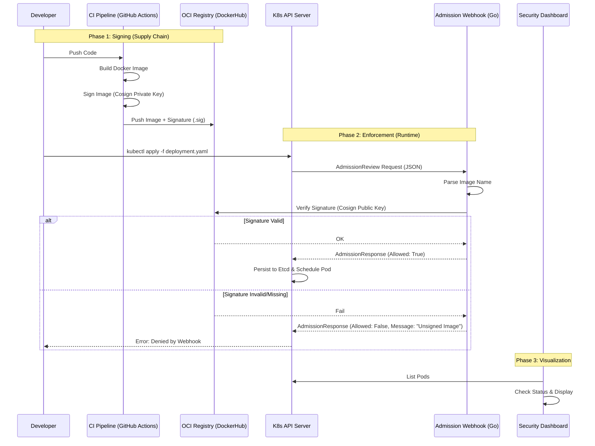

Đây là tài liệu kiến trúc kỹ thuật (Technical Architecture Document) đầy đủ cho dự án **Signed Images Admission**. Bạn có thể copy nội dung này vào file `ARCHITECTURE.md` hoặc `README.md` trong repo của bạn để làm kim chỉ nam phát triển.

---

# Architecture Document: Signed Images Admission System

## 1. Tổng quan (Overview)

Hệ thống **Signed Images Admission** là một giải pháp bảo mật chuỗi cung ứng phần mềm (Software Supply Chain Security) cho Kubernetes. Nó hoạt động như một "người gác cổng" (Gatekeeper), đảm bảo rằng chỉ các container image đã được ký (signed) và xác thực bởi tổ chức mới được phép chạy trong cluster.

### Mục tiêu chính

* **Prevent:** Chặn đứng việc deploy các image không rõ nguồn gốc hoặc đã bị thay đổi (tampered).
* **Visibility:** Cung cấp giao diện trực quan hiển thị trạng thái bảo mật của các workload đang chạy.
* **Compliance:** Đảm bảo tuân thủ quy trình CI/CD an toàn.

---

## 2. Sơ đồ kiến trúc (High-Level Architecture)

Luồng dữ liệu di chuyển từ máy Developer, qua hệ thống CI, lên Registry và cuối cùng được kiểm duyệt tại Kubernetes Cluster.




---

## 3. Các thành phần chi tiết (Component Details)

### A. The Signer (CI/CD Pipeline)

Nơi tạo ra "sự tin cậy" (Trust Anchor).

* **Công cụ:** GitHub Actions + Cosign.
* **Nhiệm vụ:**
1. Build Docker image.
2. Push image lên Registry.
3. Dùng Private Key để ký vào SHA256 (digest) của image.
4. Push chữ ký (dưới dạng OCI artifact `.sig`) lên Registry cùng chỗ với image.


### B. The Gatekeeper (Admission Webhook Service)

Thành phần cốt lõi viết bằng **Golang**.

* **Loại:** Kubernetes Validating Admission Webhook.
* **Giao thức:** HTTPS (Bắt buộc TLS).
* **Logic xử lý:**
1. Nhận `AdmissionReview` JSON từ K8s API.
2. Lọc lấy danh sách `containers` và `initContainers` từ object Pod.
3. Với mỗi image, sử dụng thư viện `github.com/sigstore/cosign` để kiểm tra chữ ký trên Registry bằng Public Key.
4. Trả về `AdmissionResponse`:
* `Allowed: true`: Nếu tất cả image đều hợp lệ.
* `Allowed: false`: Nếu có bất kỳ image nào không có chữ ký hoặc chữ ký sai. Kèm theo `Status.Message` giải thích lý do.


### C. The Configuration (K8s Resources)

Cầu nối giữa K8s và Webhook Service.

* **ValidatingWebhookConfiguration:** Resource quan trọng nhất. Nó bảo K8s: *"Khi có lệnh Create/Update Pod, hãy hỏi dịch vụ này trước"*.
* **Secret (TLS):** Chứa `tls.crt` và `tls.key` để Webhook chạy HTTPS.
* **ConfigMap/Secret (Public Key):** Chứa `cosign.pub` để Webhook dùng verify.

### D. The Dashboard (Frontend UI)

* **Tech Stack:** React/Next.js (hoặc đơn giản là Go template nếu muốn monolith).
* **Nhiệm vụ:** Gọi K8s API để lấy danh sách Pods, hiển thị namespace nào đang tuân thủ, namespace nào vi phạm (trong chế độ Audit).

---

## 4. Đặc tả kỹ thuật (Technical Specifications)

### 4.1. Data Structure (Webhook Payload)

Webhook cần parse đúng cấu trúc này từ K8s:

```go
// Request (Rút gọn)
type AdmissionReview struct {
    Request *AdmissionRequest `json:"request,omitempty"`
}

type AdmissionRequest struct {
    UID       string    `json:"uid"`
    Operation string    `json:"operation"` // CREATE, UPDATE
    Object    RawExtension `json:"object"` // Chứa Pod Manifest
    // ...
}

// Response
type AdmissionResponse struct {
    UID     string `json:"uid"`
    Allowed bool   `json:"allowed"`
    Result  *Status `json:"status,omitempty"` // Chứa message lỗi
}

```

### 4.2. Security Constraints

* **TLS:** Webhook **phải** chạy qua HTTPS. `caBundle` trong `ValidatingWebhookConfiguration` phải khớp với CA đã ký cert cho Webhook Service.
* **Namespace Exemptions:** Cần cấu hình `namespaceSelector` để bỏ qua các namespace hệ thống (như `kube-system`, `monitoring`) để tránh việc Webhook bị lỗi làm sập toàn bộ cluster (Deadlock).
* **Failure Policy:**
* Dev/Test: `Ignore` (Nếu Webhook chết, vẫn cho phép tạo Pod - để debug).
* Prod: `Fail` (Nếu Webhook chết, cấm tạo Pod - bảo mật tối đa).


---

## 5. Lộ trình triển khai (Implementation Steps)

Để xây dựng hệ thống này, bạn sẽ đi theo 3 bước:

1. **Hạ tầng (Infrastructure Layer):**
* Tạo SSL Certs (Self-signed).
* Deploy Go Service (Hello World) vào K8s.
* Cấu hình `ValidatingWebhookConfiguration` để K8s kết nối thành công ("Ping").


2. **Logic (Application Layer):**
* Implement logic parse JSON.
* Tích hợp Cosign SDK vào Go code.
* Mount `cosign.pub` vào container.


3. **Quy trình (Process Layer):**
* Thiết lập GitHub Actions để tự động ký image khi push.
* Test kịch bản chặn (Deny) và cho phép (Allow).


---

## Hành động tiếp theo của bạn (Next Action)

Đây là tài liệu bạn có thể lưu lại. Bây giờ, để bắt đầu **Bước 1 (Hạ tầng)**, bạn hãy tạo cấu trúc thư mục như tôi đã gợi ý ở trên và tạo file `cmd/webhook/main.go`.

Bạn có muốn tôi cung cấp đoạn mã mẫu (Boilerplate code) cho file `main.go` để xử lý HTTP Server và TLS không?


---## 6. Ví dụ luồng hoạt động (Example Workflow)
 Dev push code → Jenkins Pipeline được kích hoạt (thông qua webhook GitHub hoặc polling).
Jenkins thực hiện build Docker image, sau đó dùng Cosign ký vào image digest (SHA256) bằng private key được lưu an toàn trong Jenkins Credentials, rồi push image cùng chữ ký (.sig) lên DockerHub (OCI Registry).

Khi dev chạy:

kubectl apply -f deployment.yaml


Kubernetes API Server nhận request, tự động tạo AdmissionReview (JSON) và gọi Admission Webhook đã được đăng ký thông qua ValidatingWebhookConfiguration.

Admission Webhook (Go service) parse PodSpec từ AdmissionReview, trích xuất danh sách image, resolve image tag thành digest (SHA256), sau đó dùng public key của Cosign và thư viện Cosign SDK để verify chữ ký bằng cách lấy signature tương ứng từ DockerHub.

Nếu tất cả image đều có chữ ký hợp lệ → Webhook trả về:

{ "allowed": true }


Kubernetes API Server tiếp tục ghi object vào etcd và tạo Pod.

Nếu bất kỳ image nào không có chữ ký hoặc chữ ký không hợp lệ → Webhook trả về:

{ "allowed": false }


Kubernetes API Server từ chối request, Pod không được tạo.